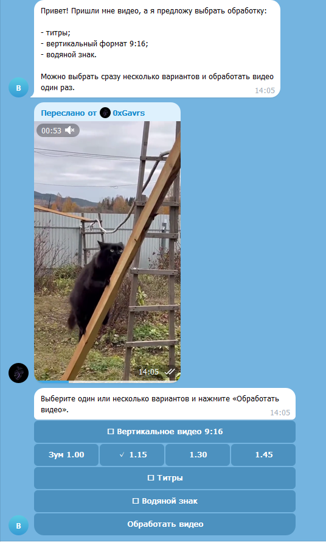
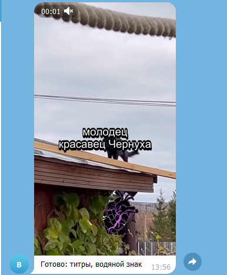

# Bot Video Editor

Telegram-бот для быстрой подготовки роликов под соцсети: Shorts, Reels, TikTok, VK Клипы и другие вертикальные форматы. Бот принимает видео, предлагает выбрать нужные действия и возвращает готовый MP4.

## Для чего нужен

Бот помогает быстро привести обычный ролик к формату публикации в соцсетях:

- сделать вертикальное видео `9:16`;
- добавить размытый фон вместо черных полей;
- приблизить видео к центру, чтобы уменьшить пустые зоны;
- добавить водяной знак поверх ролика;
- автоматически распознать речь и прожечь титры;
- совместить несколько действий за один проход обработки.

Это удобно для нарезки фрагментов из видео, монтажа коротких роликов, оформления контента под Shorts/Reels и быстрой подготовки материалов без ручного открытия видеоредактора.

## Как работает бот

1. Пользователь отправляет видео в Telegram.
2. Бот скачивает файл и показывает меню выбора обработки.
3. Можно отметить один или несколько пунктов:
   - вертикальное видео;
   - титры;
   - водяной знак.
4. Для вертикального видео можно выбрать уровень приближения.
5. После нажатия `Обработать видео` бот запускает FFmpeg и возвращает готовый ролик.

## Скриншоты

### Выбор обработки в боте



### Готовый результат



## Возможности

- Telegram Bot API на `python-telegram-bot`.
- Обработка видео через FFmpeg.
- Вертикальный формат `1080x1920`.
- Размытый фон из копии исходного видео.
- Настраиваемый zoom для центрального видео.
- Водяной знак из PNG-файла.
- Автоматические русские титры через `faster-whisper`.
- Более короткие и читаемые субтитры по word timestamps.
- Один общий FFmpeg-проход для комбинаций: вертикаль + титры + водяной знак.
- Проверка размера входного файла.
- Тесты для конфигурации, ASR, Telegram-логики и FFmpeg-команд.

## Быстрый старт на Windows

1. Установите зависимости:

```bat
install_dependencies.bat
```

2. Создайте бота через `@BotFather`.

3. Укажите токен одним из способов:

- в файле `.env`:

```env
TELEGRAM_BOT_TOKEN=123456:your-token
```

- или в `src/video_editor_bot/config.py`.

4. Запустите проект:

```bat
run_project.bat
```

## Настройки

Все основные настройки находятся в `src/video_editor_bot/config.py`.

| Настройка | По умолчанию | Описание |
| --- | --- | --- |
| `WORKDIR` | `workdir` | Папка временных файлов |
| `MAX_VIDEO_MB` | `50` | Максимальный размер входного видео |
| `TELEGRAM_DOWNLOAD_LIMIT_MB` | `20` | Лимит скачивания через облачный Telegram Bot API |
| `OUTPUT_WIDTH` | `1080` | Ширина вертикального видео |
| `OUTPUT_HEIGHT` | `1920` | Высота вертикального видео |
| `WATERMARK_IMAGE_PATH` | `D:/gavrs/иконка.png` | PNG для водяного знака |
| `ASR_PROVIDER` | `faster-whisper` | Провайдер распознавания речи |
| `WHISPER_MODEL` | `large-v3-turbo` | Модель для распознавания речи |

## Титры

Для бесплатного локального распознавания используется `faster-whisper`. Бот настроен на русский язык и использует word timestamps, чтобы резать субтитры на короткие фразы. Это делает титры ближе к реальному диалогу и удобнее для коротких вертикальных роликов.

Титры прожигаются прямо в видео через FFmpeg: белый текст, черная обводка, нижнее расположение с отступом.

Первый запуск режима с титрами может быть долгим, потому что модель `large-v3-turbo` скачивается в кэш. Следующие обработки будут стартовать быстрее.

## Linux/macOS

```bash
python -m venv .venv
source .venv/bin/activate
pip install -r requirements.txt
python -m video_editor_bot.main
```

## Разработка

Установка с dev-зависимостями:

```bash
pip install -e ".[dev]"
```

Запуск тестов:

```bash
python -m pytest
```

## Архитектура

```text
Telegram Bot API
      |
      v
bot.py                    UX, кнопки, выбор режимов обработки
      |
      v
services/jobs.py          Создание рабочей папки и путей файлов
      |
      v
services/asr.py           Распознавание речи и генерация SRT
      |
      v
services/video_processor.py
                           FFmpeg: вертикаль, zoom, титры, водяной знак
      |
      v
storage.py                Скачивание файлов из Telegram
```

## Важно про лимиты Telegram

Облачный Telegram Bot API обычно ограничивает скачивание файлов для ботов. Если нужно обрабатывать видео больше лимита, запустите локальный Telegram Bot API server и увеличьте `TELEGRAM_DOWNLOAD_LIMIT_MB` вместе с `MAX_VIDEO_MB`.

## Лицензия

MIT
